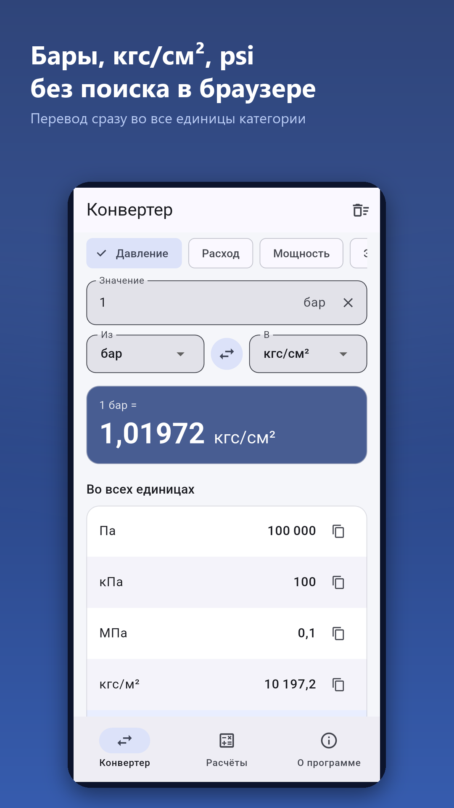
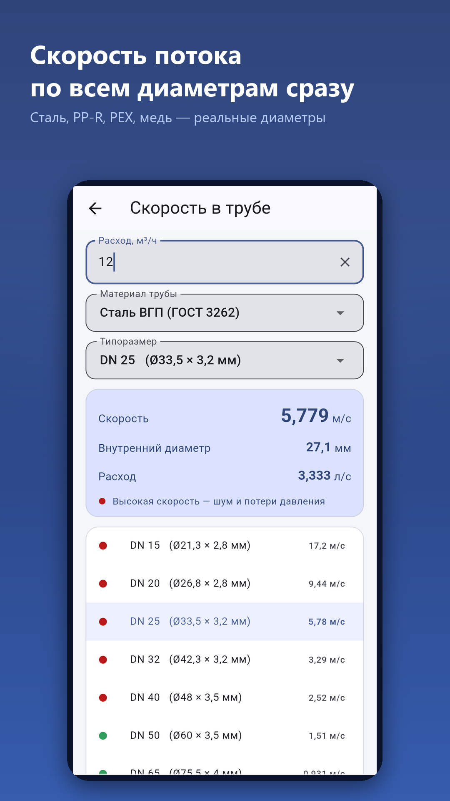
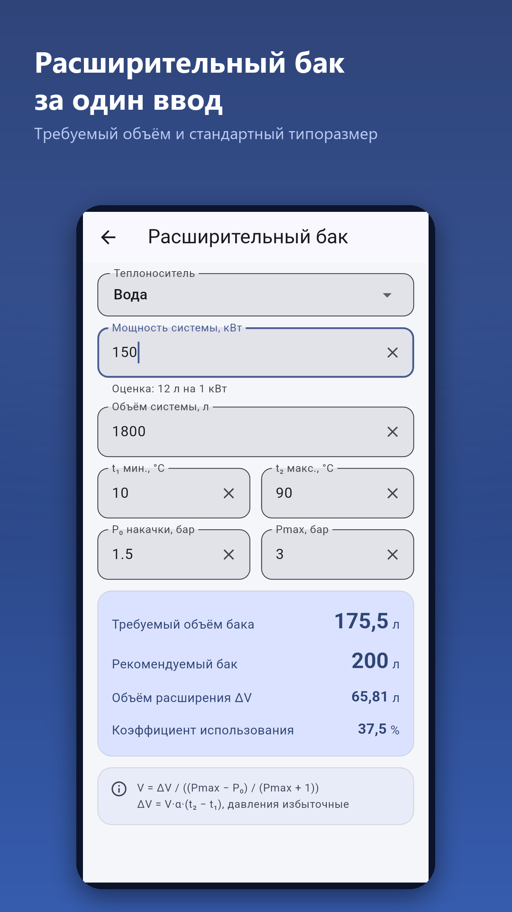

# Eng Converter — инженерный конвертер и расчёты ОВиК

Мобильное приложение для инженеров отопления, вентиляции и кондиционирования:
конвертер единиц и пять расчётов. Работает офлайн, без рекламы и регистрации.
Одна кодовая база на Flutter для Android и iOS.

<p align="center">
  
  
  
</p>

## Что умеет

**Конвертер** — 10 категорий, около 80 единиц: давление, расход, мощность, энергия,
температура, длина, площадь, объём, масса, скорость. Значение сразу пересчитывается во
все единицы категории, любое из них копируется нажатием.

**Расчёты**

| Расчёт | Что считает |
|--------|-------------|
| Скорость в трубе | Расход → скорость по всем типоразмерам сразу, сталь ВГП до DN 350, PP-R, PEX, медь с реальными внутренними диаметрами и оценкой «низкая / норма / высокая» |
| Тепловая мощность | Q = G·ρ·c·ΔT в обе стороны (расход → мощность и мощность → расход), вода и гликоли, плотность и теплоёмкость по температуре |
| Потери на клапане | ΔP по Kvs и подбор Kvs по заданному ΔP |
| Расширительный бак | Требуемый объём и ближайший стандартный типоразмер, проверка t₂ > t₁ и Pmax > P₀ |
| Изоляция труб | Площадь, площадь на метр, объём и диаметр с изоляцией для спецификации |

Ввод принимает запятую и точку, открывается цифровая клавиатура. Русский и английский,
светлая и тёмная тема, выбранные единицы и настройки сохраняются.

## Структура

```
flutter_app/
  lib/core/     расчёты, единицы, разбор и форматирование чисел, строки интерфейса
  lib/ui/       экраны: конвертер, список расчётов, пять расчётов, настройки
  test/         33 теста: расчёты, форматирование, поведение экранов
make_icon_v6.py            генерация иконок для Android и iOS из исходного изображения
make_store_screenshots.py  сборка скриншотов и баннера для магазинов
docs/AUDIT_v5.7.md         разбор ошибок предыдущей версии на Kivy
```

## Сборка

```bash
cd flutter_app
flutter pub get
flutter test
flutter build apk --release        # RuStore
flutter build appbundle --release  # Google Play
flutter build ipa --release        # App Store, только на macOS
```

Подпись Android берётся из `android/key.properties` (файл не в репозитории):

```properties
storeFile=release-key.jks
storePassword=...
keyAlias=...
keyPassword=...
```

Ключи, сертификаты и профили в репозиторий не попадают, в CI они приходят из секретов
GitHub Actions. См. [.github/workflows/build-flutter.yml](.github/workflows/build-flutter.yml).

## История

Версии до 5.7 были написаны на Python и Kivy, причём Android и iOS жили в двух
разошедшихся копиях одного файла. Версия 6.0 — переписывание на Flutter одной кодовой
базой. Что было сломано в старой версии и как это исправлено, разобрано в
[docs/AUDIT_v5.7.md](docs/AUDIT_v5.7.md).

## Лицензия

MIT, см. [LICENSE](LICENSE).
